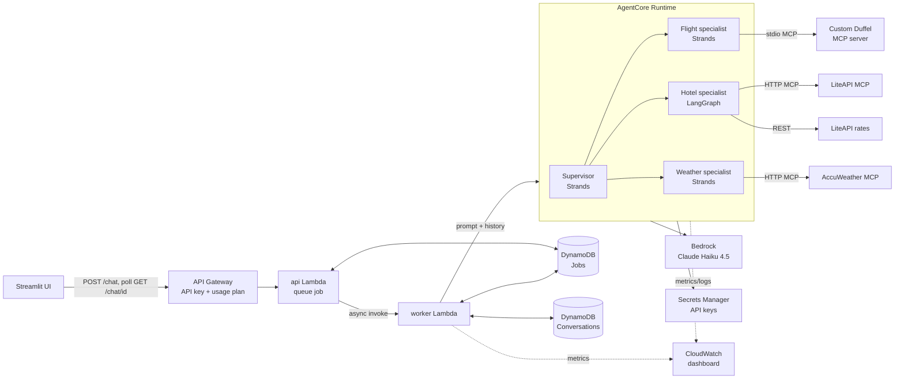

# Agentic AI Travel Planner

A multi-agent travel planner on **Amazon Bedrock AgentCore**. A supervisor agent breaks a trip
request into parts and delegates to flight, hotel and weather specialists, each working against
real travel APIs through **MCP** (Model Context Protocol), then combines their answers into one plan.

> "Weekend in Austin from DFW, leaving this Friday, back Sunday, hotel under $250/night"
> → nonstop round-trip options with prices, hotels with live nightly rates, and a day-by-day forecast.

See [example conversations](docs/examples.md) · [lessons learned](docs/lessons-learned.md) · [demo script](docs/demo-script.md)

## Architecture



**How a request flows.** API Gateway checks the API key and hands the message to the `api` Lambda,
which records a job and returns `202 {job_id}` immediately (a full plan takes 25-40 s, past API
Gateway's ~29 s limit). The `worker` Lambda loads the session's last 20 turns from DynamoDB, sends
them with the message to the AgentCore runtime, saves both turns, and marks the job done. The
client polls `GET /chat/{job_id}`. The runtime is stateless: it builds a fresh supervisor from the
history on every request, so sessions never share context.

| Component | What it does |
|---|---|
| [supervisor.py](supervisor.py) | Strands supervisor; specialists are exposed to it as tools (agents-as-tools) |
| [agents/flight_agent.py](agents/flight_agent.py) | Strands agent using the custom Duffel MCP server |
| [mcp_servers/duffel_server.py](mcp_servers/duffel_server.py) | Custom FastMCP server over Duffel's flight API; trims offers to what an LLM needs |
| [agents/hotel_graph.py](agents/hotel_graph.py) | LangGraph ReAct workflow: LiteAPI MCP for search (read-only allowlist) + a REST rates tool |
| [agents/weather_agent.py](agents/weather_agent.py) | Strands agent on AccuWeather's hosted MCP server (5 of 26 tools) |
| [agents/dates.py](agents/dates.py) | Gives every agent today's date and a weekday lookup table, refreshed per call |
| [agentcore_app.py](agentcore_app.py) | AgentCore Runtime entrypoint; loads API keys from Secrets Manager |
| [infra/](infra/) | Python CDK: API Gateway, api/worker Lambdas, DynamoDB, CloudWatch dashboard |
| [ui/app.py](ui/app.py) | Streamlit chat UI (local, direct-runtime, or public-API mode) |
| [tests/smoke.py](tests/smoke.py) | Checks every MCP server, API key and tool allowlist without an LLM |

**Stack:** Python 3.13 · Strands Agents · LangGraph / LangChain · MCP · Amazon Bedrock (Claude Haiku 4.5)
· Bedrock AgentCore Runtime · API Gateway · Lambda · DynamoDB · Secrets Manager · CloudWatch · AWS CDK · Streamlit

## Run it locally

You need Python 3.13, AWS credentials with Bedrock access, and free API keys:

- **Bedrock:** a model with tool use, e.g. the inference profile `us.anthropic.claude-haiku-4-5-20251001-v1:0`
- **Duffel:** a **test** access token (`duffel_test_...`)
- **AccuWeather:** a free trial key from developer.accuweather.com
- **LiteAPI:** the sandbox key (`sand_...`) from dashboard.liteapi.travel

```bash
python -m venv .venv && source .venv/bin/activate
pip install -r requirements.txt
cp .env.example .env          # fill in the keys and BEDROCK_MODEL_ID

python -m tests.smoke         # all three MCP servers and keys, no LLM needed
python supervisor.py "Weekend in Austin from DFW, leaving this Friday, back Sunday"
streamlit run ui/app.py       # chat UI on localhost:8501
```

The UI picks its mode from `.env`: `TRAVEL_API_URL` + `TRAVEL_API_KEY` → the public API;
`AGENTCORE_RUNTIME_ARN` → the AgentCore runtime directly; neither → agents run in-process.

## Deploy to AWS

Set a billing budget alarm first: Bedrock tokens and AgentCore are pay-per-use.

**1. API keys → Secrets Manager.** Store the three keys as one JSON secret named `travelagent`
(keys `DUFFEL_ACCESS_TOKEN`, `ACCUWEATHER_API_KEY`, `LITEAPI_API_KEY`). The runtime reads it
at startup ([secrets_loader.py](secrets_loader.py)); its IAM role can read only that secret
([iam/read-travel-secret.json](iam/read-travel-secret.json)).

**2. Agent → AgentCore Runtime** with the [AgentCore CLI](https://www.npmjs.com/package/@aws/agentcore)
(`npm install -g @aws/agentcore`, needs `uv`). Config is in [agentcore/agentcore.json](agentcore/agentcore.json);
update the account ID in `agentcore/aws-targets.json` and `iam/read-travel-secret.json` for your account.
Run from a shell **without** `.venv` activated (the deprecated Python toolkit's `agentcore` would shadow it):

```bash
rm -rf infra/.build infra/cdk.out   # the CLI zips the project folder; keep CDK build output out
agentcore deploy --diff
agentcore deploy
```

**3. Public API → CDK** ([infra/app.py](infra/app.py)). Reads the runtime ARN from
`agentcore/.cli/deployed-state.json`:

```bash
cd infra
npx aws-cdk@2 deploy
aws apigateway get-api-key --api-key <ApiKeyId output> --include-value --query value --output text
```

Put the `ApiUrl` output and the key in `.env` as `TRAVEL_API_URL` / `TRAVEL_API_KEY`, or call it directly:

```bash
curl -s -X POST "$TRAVEL_API_URL/chat" -H "x-api-key: $TRAVEL_API_KEY" \
  -d '{"message": "Weather in Austin this Saturday?"}'          # -> {"job_id": ..., "session_id": ...}
curl -s "$TRAVEL_API_URL/chat/<job_id>" -H "x-api-key: $TRAVEL_API_KEY"   # -> {"status": "done", "reply": ...}
```

Pass the returned `session_id` with the next message to continue the conversation. Every request
needs the key; the usage plan caps traffic at 5 requests/s and 2,000/day.

## Observability

The CDK stack creates a CloudWatch dashboard named **TravelPlanner** with API requests and
4xx/5xx errors, completed and failed jobs, **calls per specialist** (a custom metric the worker
publishes in CloudWatch embedded metric format), AgentCore latency (p50/p90/max), end-to-end
worker duration, errors by component, and Bedrock token counts and latency.
Runtime logs and traces are in CloudWatch under `/aws/bedrock-agentcore/runtimes/`.

## Design notes

- **Read-only tool allowlists.** LiteAPI's MCP server exposes 91 tools, including bookings,
  payments and cancellations. The hotel agent gets 4 search tools plus a rates tool; it can't book anything.
- **Async API instead of a raised timeout.** Works without a Service Quotas request and never times out.
- **Stateless runtime, history in DynamoDB.** One place owns conversation state; turns expire after 7 days.
- **Test environments only.** Duffel test mode and LiteAPI sandbox: prices are realistic but nothing is bookable.

Full write-up of the problems hit along the way: [docs/lessons-learned.md](docs/lessons-learned.md).

## Tear down

```bash
cd infra && npx aws-cdk@2 destroy            # API, Lambdas, DynamoDB tables, dashboard
agentcore remove all && agentcore deploy      # AgentCore runtime stack (from the project root)
aws secretsmanager delete-secret --secret-id travelagent
```
